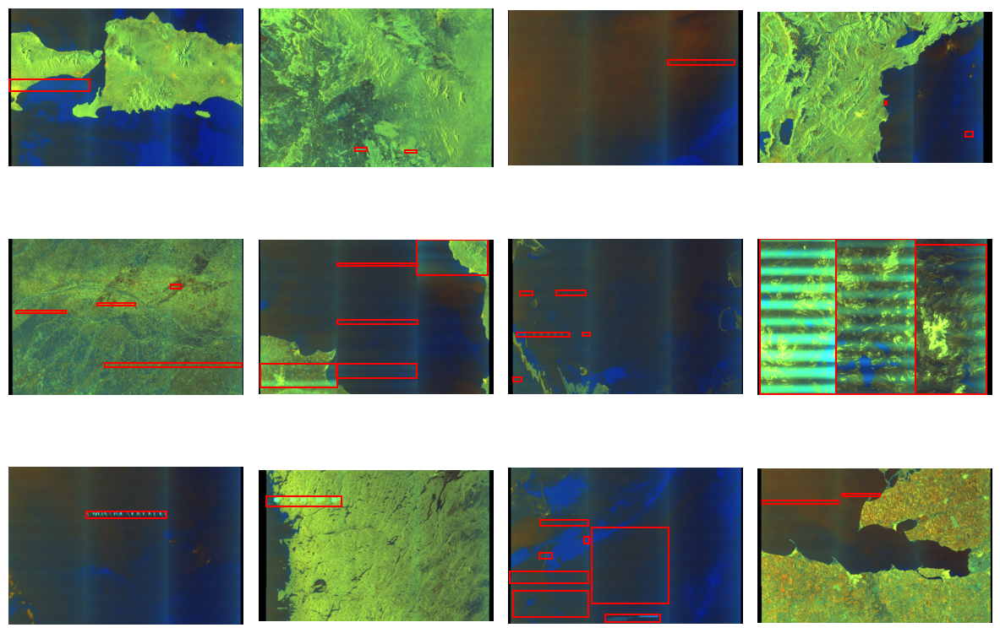
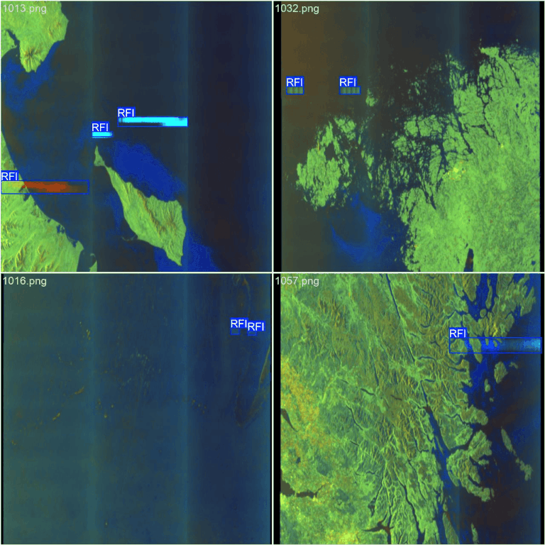
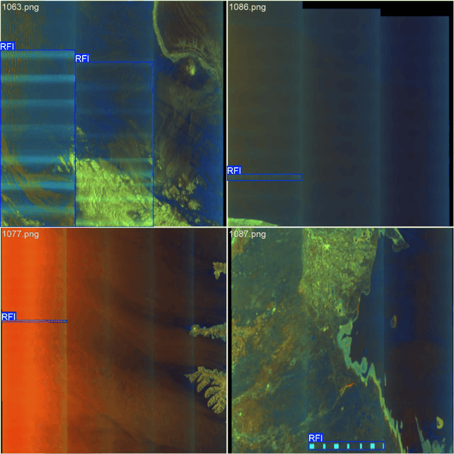
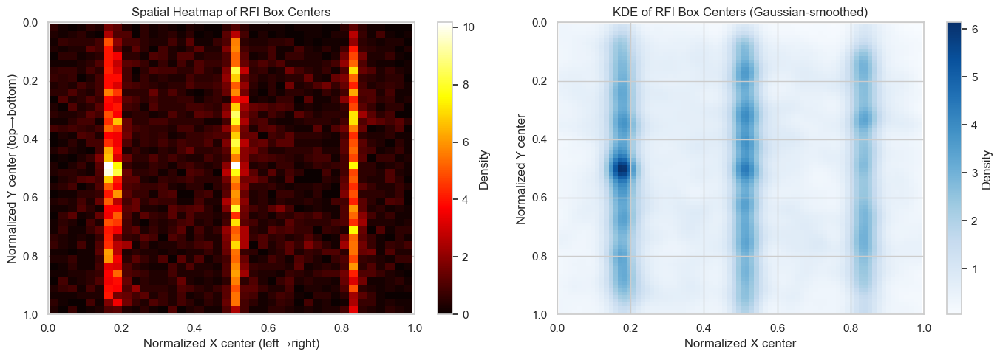
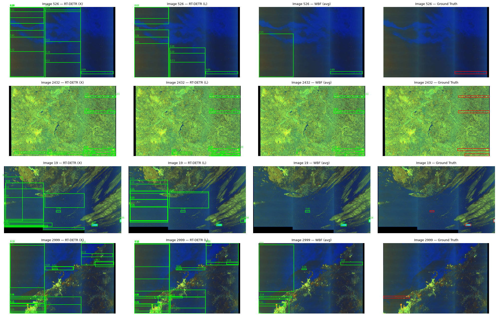
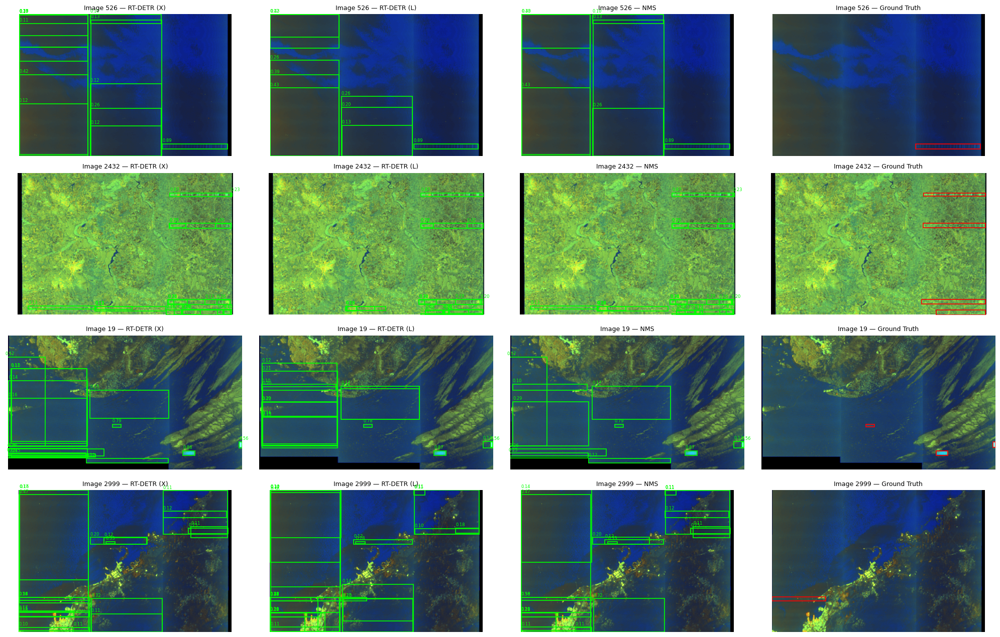

# ESA Φ-lab ClearSAR // RFI Detection in Sentinel-1 SAR

This is my run through the [ESA Φ-lab ClearSAR challenge](https://platform-challenges.philab.esa.int/clear-sar). The task was to perform object detection on Sentinel-1 SAR quicklook RGB images to detect Radio-Frequency Interference (RFI). No restrictions in terms of models or approaches were set, and the metric being evaluated was `COCO mAP@IoU=0.50:0.95`.

<br><br><br>
<p align="center">
  
  <br><em>Training batch with RFI annotations</em>
</p>
 
<br><br><br>

# Using the model

The best score I managed to get was from single-model fine-tune of `RT-DETR-X`, getting a `0.4682 mAP` on the test dataset. For reference, the top 10 threshold finished at `0.4875`.

<br><br><br>
<p align="center">
  
  &nbsp;&nbsp;
  
  <br><em>Some validation images and the prediction with my best attempt</em>
</p>
<br><br><br>

Weights can be found as a release asset for this repo. If you want to try the model you'll need `python>=3.11`. All you have to do is, in an environment of your choice:

```bash
pip install ultralytics

# Download the weights
mkdir checkpoints
curl -L https://github.com/vic-zab/esa_clearsar/releases/latest/download/best.pt -o checkpoints/rtdetr_best.pt
```

Then run inference on an image of your choice (`your_image.png`) with the following:

```python
from ultralytics import RTDETR

model = RTDETR("checkpoints/rtdetr_best.pt")
results = model.predict(source="your_image.png", imgsz=640, conf=0.01, device="cuda")
results[0].show()
```
<br><br><br>

# A little walk through the whole process
I am now going to briefly discuss the development of the whole project, things I've tried, things that have worked out and things that have not worked out. Notebooks can be found in the `ClearSAR/` folder.
<br><br>

## Exploratory Data Analysis (`EDA_notebook.ipynb`)
Before doing anything, the usual: get to know the data.
We're provided the following *Dataset* from the [eotdl site](https://www.eotdl.com/datasets)

<div align="center">

| Split | Images | Annotations |
|-------|--------|-------------|
| Train | 3,154  | 9,288       |
| Test  | 786    | —           |

</div>
<br>

Together with the initial *Dataset*, we're provided with annotations in `COCO` format ( `instances_train.json` )
<br><br>
After doing some exploration, the most important insight was the three-column spatial prior: RFI box centers cluster at x≈0.15, 0.50, 0.85. Since the columns are symmetric around x=0.5, horizontal flip is a free augmentation.

<br><br><br>
<p align="center">
  
  <br><em>Normalized spatial distribution of the bounding boxes</em>
</p>
<br><br><br>

## YOLOv8 baseline (`ClearSAR/phase_1.ipynb`)

Established a baseline, trained at 640x640 with letterboxing, reached **0.4285 val mAP@0.50:0.95**
<br><br>

## Architecture Experiments + RT-DETR (`ClearSAR/phase_2.ipynb`)

Two parallel experiments:
- **Exp B:** YOLO with a 4th positional channel encoding x-position. Result: +0.0008 mAP (0.4293).
- **Exp C:** First RT-DETR run. RT-DETR-L, same training setup. Result: **0.4484 val mAP**. Transformer cross-attention exploits the spatial prior naturally without any hand-engineering.
<br><br>

## WBF Ensemble: RT-DETR-L + YOLO (`ClearSAR/phase_3.ipynb`)

Attempted to fuse the two best models via Weighted Boxes Fusion (WBF) at `iou_thr=0.25`. Result: **~0.35–0.38 mAP**.
<br><br>

## RT-DETR-X **(Best Single Model)** (`ClearSAR/phase_4.ipynb`)

Scaled up to RT-DETR-X (~65M params, vs ~32M for L). Same augmentation as Exp C, that part already worked, no reason to touch it. Result: **0.4503 val mAP / 0.4682 test mAP**. Current best.

A couple of things that turned out to matter:
- `amp=False` is **mandatory** — AMP produces NaN losses with RT-DETR-X at any LR
- `optimizer="AdamW"` set explicitly — Ultralytics' `"auto"` silently overrides `lr0` and picks its own peak
- Bigger warmup (10 epochs vs 5 for L) — larger models are more sensitive to the first few epochs

Training recipe for the best run:

<div align="center">

| Param | Value |
|-------|-------|
| `model` | `rtdetr-x.pt` (COCO pretrained) |
| `imgsz` | 640 |
| `epochs` | 150 (early-stopped around epoch 100) |
| `batch` | 6 (VRAM-bound on RTX 5080, 16 GB) |
| `optimizer` | `AdamW` |
| `lr0` / `lrf` | `1e-3` / `0.001` (cosine to ~1e-6) |
| `warmup_epochs` | 10 |
| `amp` | `False` |
| `fliplr` | 0.5 |
| `mosaic` / `close_mosaic` | 1.0 / 10 |
| `copy_paste` | 0.1 |
| `hsv_h` / `hsv_s` / `hsv_v` | 0.0 / 0.3 / 0.4 |
| `degrees` / `flipud` | 0.0 / 0.0 (stripes are strictly horizontal) |

</div>
<br><br>

## RT-DETR-X + extra P2 (`ClearSAR/phase_5.ipynb`)

My intuition was that the thinnest boxes were slipping through because of the feature map downsampling in the FPN, so I tried adding a P2 stride-4 head to RT-DETR-X (76M params, 4-level decoder). Result: **0.3482 val mAP**.
<br><br>

# Exploiting the outputs from multiple models
As I was not getting better results from single models after trying a bunch of different stuff, I pivoted to try and leverage different outputs through, mainly, `Weighted Boxes Fusion (WBF)` and `Non-Maximum Suppression (NMS)`.
<br><br>
Now, let's visually take a look at what's happening with both kinds of ensemble. We'll start with WBF, which was applied without previously filtering by confidence (`WBF_SKIP_BOX_THR = 0`) and setting its `WBF_IOU_THR = 0.25`. Here are the results:

<br><br><br>
<p align="center">
  
  <br><em>WBF ensemble of the Large and eXtra versions of RT-DETR (first 2 images in each row) — Ground truth boxes in red </em>
</p>
<br><br><br>

Same thing for the NMS, except we've used this time `NMS_IOU_THR = 0.5`:

<br><br><br>
<p align="center">
  
  <br><em>NMS ensemble of the same outputs </em>
</p>
<br><br><br>


Interestingly, WBF tends to produce visually better results, yet NMS yields a higher `mAP`, which is why the latter was the merging method used for ensembling.
<br><br> 

# 7-model ensemble through NMS (`ClearSAR/bagging_ensemble/`)

As a final step, I trained 7 models on disjoint validation splits (so each model sees unique data) and then ensembled their predictions on the test set via NMS. The ensemble did beat the average performance of the individual models, but only marginally, and it didn't outperform the single best model, so, not much to show for it.